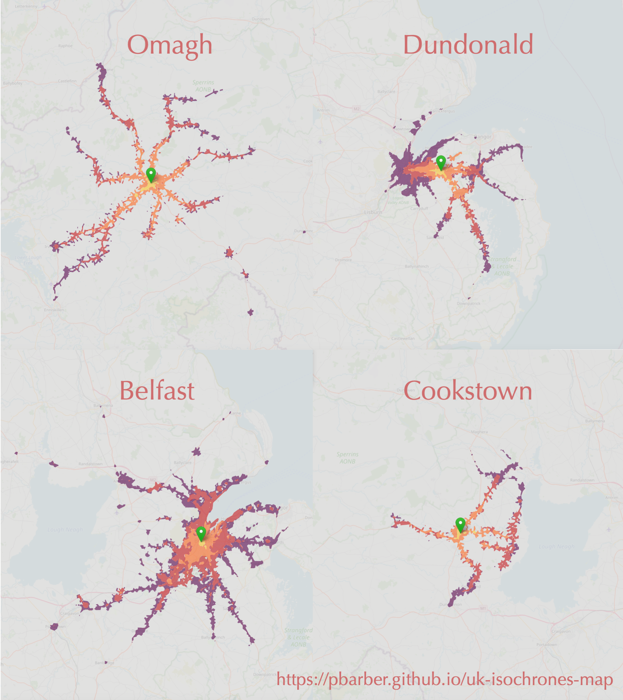

# NI Travel app

This was a searchable map of NI showing areas that can be reached from different locations using public transport within 15/30/45/60 minutes. It now forwards all traffic to a [newer version of the site](https://pbarber.github.io/uk-isochrones-map) covering all of the UK.

See the [UK site documentation](https://github.com/pbarber/uk-isochrones-map/blob/main/README.md) for more details.

